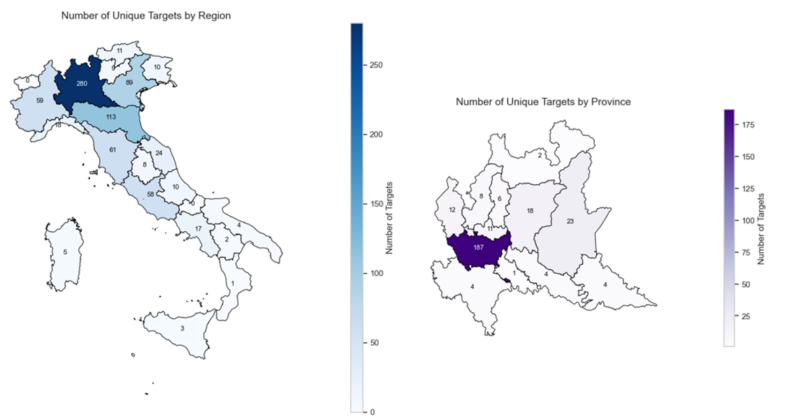

# 🏛️ Master Thesis on Family Offices and Private Equity

This repository contains the code and materials developed for my **Master Thesis**:  
**“Ownership Similarity and Investor Identity: A Quantitative Study on Family Office and Private Equity Deals”**,  
completed as part of the *Management Engineering – Analytics for Business* program at **Politecnico di Milano**.

The research investigates how **ownership similarity** between investors and targets affects post-acquisition performance, with a focus on the investment behavior of **Family Offices (FOs)** and **Private Equity (PE)** firms.  
The analysis combines *descriptive statistics, econometric modeling (Heckman correction, regression analysis), and visualization techniques* in Python.

---

## 📘 Overview

- **Objective:**  
  To analyze the relationship between investor type, ownership structure, and performance outcomes in M&A transactions involving Family Offices and Private Equity funds.

- **Research Questions:**  
  1. Are Family Offices more likely to invest in family-owned businesses?  
  2. Do ownership similarities (e.g., family-to-family acquisitions) improve post-acquisition performance?  
  3. How do investment characteristics (e.g., control, deal size) differ between Family Offices and Private Equity firms?

- **Approach:**  
  1. **Data Collection & Preprocessing:** Integration of financial, ownership, and deal-level datasets.  
  2. **Exploratory Data Analysis (EDA):** Descriptive trends by investor type, ownership, and region.  
  3. **Econometric Analysis:**  
     - Heckman two-stage model to correct for self-selection bias.  
     - Regression on post-deal performance metrics.  
  4. **Visualization:** Geographic and ownership-pattern mapping using shapefiles.

- **Outcome:**  
  A reproducible Python-based workflow that bridges **finance, ownership theory, and data analytics**, offering insights into how investor identity shapes acquisition outcomes.

---

## 🛠️ Tech Stack

- **Language:** Python 3.10  
- **Main Libraries:**  
  `pandas`, `numpy`, `matplotlib`, `seaborn`, `statsmodels`, `scipy`, `geopandas`, `shapely`, `sklearn`  
- **Notebook Environment:** Jupyter (`.ipynb`)  
- **Data Visualization:** Geo-mapping and statistical plots  
- **Documentation:** PDF reports (thesis + executive summary)

---

## 📂 Project Structure
```
fo-pe-thesis/
├── data/                      # Input data
│   ├── datasets/              # Main XLSX datasets used in the analysis
│   └── shapefiles/            # Geographic boundaries (NUTS, Natural Earth)
├── notebooks/                 # Jupyter notebooks
│   └── MASTER THESIS.ipynb
├── documents/                 # Final thesis documents
│   ├── 2025_10_Sima_Tesi_01.pdf
│   └── 2025_10_Sima_Executive_Summary_02.pdf
├── assets/                    # Figures and supplementary reports
│   └── EDA_Sima.pdf           # Exploratory Data Analysis (EDA) report
├── .gitignore
├── LICENSE
└── README.md
```

---

## 💾 Data Description

The empirical analysis relies on a multi-step dataset construction process combining deal-level, firm-level, and investor-level information:  

- **Original Transaction Dataset**  
  The starting point was the *“Family Transaction Merged”* file (1,188 observations, 2013–2022). It includes detailed information on each M&A deal, such as completion date, target ownership, acquirer and seller names, deal value, and post-deal equity share.  

- **Target Dataset**  
  For each target firm, financial and structural variables were collected from *Orbis* for the years *t–1*, *t*, and *t+1* (where *t* = deal year).  
  Collected indicators cover:  
  - **Profitability:** ROA, ROE, EBITDA, EBITDA margin, Net Income.  
  - **Size and Valuation:** Revenues, Enterprise Value, Market Capitalization.  
  - **Capital Structure:** Gearing ratio, Operating Cash Flow, valuation multiples (EV/EBITDA, Market-to-Book).  

- **Investor Dataset**  
  Each acquiring entity was classified according to ownership type (Family Office, Private Equity, Corporate, etc.).  
  This classification was validated through multiple reliable sources (company websites, financial databases, and specialized reports).  

This integrated structure allows a comprehensive multi-level analysis of ownership patterns and performance dynamics across Family Office and Private Equity transactions.  

---

## 🚀 How to Run

1. **Clone the repository**
   ```
   git clone https://github.com/stesima/fo-pe-thesis.git
   cd fo-pe-thesis
   ```

2. **Install dependencies**
   Make sure you have Python 3.8+ installed, then run:
   ```
   pip install -r requirements.txt
   ```

3. **Run the analysis**
   Open the main notebook:
   ```
   jupyter notebook notebooks/MASTER THESIS.ipynb
   ```
   or view it directly on GitHub.

---

## 📊 Key Insights


**H1 – Family Offices and family-owned targets**:
Statistical tests and logistic regression analysis found **no significant evidence** that Family Offices are more likely than Private Equity firms to invest in family-owned businesses.

**H2 – Ownership similarity and post-deal performance**:
Regression results on ΔROA (t–1 to t+1) showed a **weak, non-significant positive effect** of ownership similarity, which turned negative once corrected for self-selection bias using a **Heckman two-step model**.

**H3 – Minority vs. Majority stakes**:
Evidence confirmed that **Family Offices predominantly acquire minority stakes**, while **Private Equity firms systematically pursue majority control** positions.

**Additional findings**
- High **pre-deal leverage (gearing ratio)** correlated with stronger post-deal improvements, consistent with the disciplining role of debt.
- **Sector effects** were generally weak, with only **Real Estate** showing near-significant influence on performance.
- The short-term evaluation window *(t–1 to t+1)* may partially explain the lack of strong post-acquisition effects.
  
For a detailed interpretation and discussion of the empirical results, refer directly to the **Master Thesis document** included in the repository (`documents/2025_10_Sima_Tesi_01.pdf`).
 

---


## 🗺️ Sample Visualization

The following maps illustrate the **geographical distribution of unique M&A targets** across Italy and the Lombardy region.  
The left figure shows the **number of unique targets by region**, while the right one focuses on **Lombardy’s provinces**, highlighting Milan as the main hub for Family Office and Private Equity activity.



---

## ✉️ Contact

**Author:** Stefano Sima  
- 📧 [stefano.sima@mail.polimi.it](mailto:stefano.sima@mail.polimi.it)  
- 💼 [LinkedIn](https://www.linkedin.com/in/stesima)  
